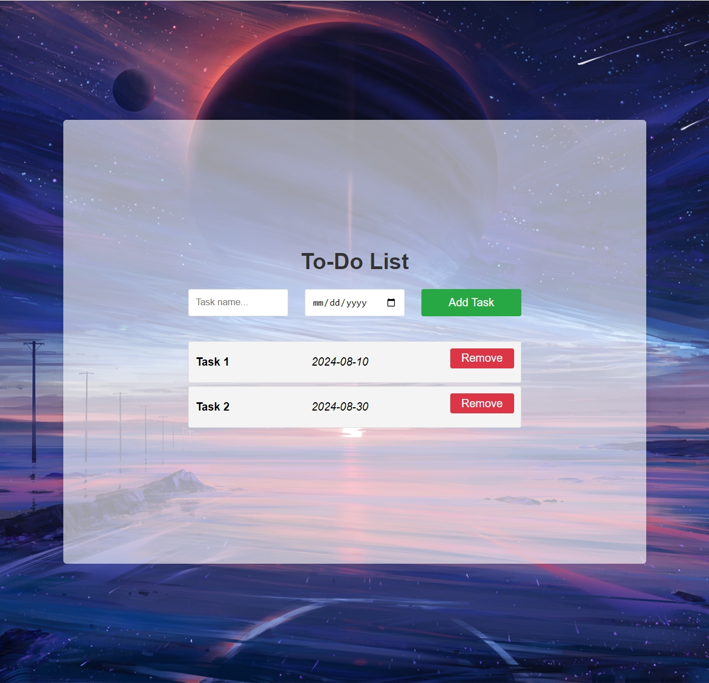

# To-Do List

A simple and convenient To-Do list application that allows users to record and manage their tasks efficiently.

## Features

- **Add Tasks:** Users can add new tasks with a task name and a deadline.
- **Remove Tasks:** Users can remove tasks from the list once they are completed or no longer needed.
- **Persistent Storage:** The list of tasks is saved in the browser's local storage, so even if the page is refreshed, tasks remain saved.
- **Sort by Deadline:** Tasks are automatically sorted by their deadline, with the closest deadlines appearing at the top.

## Usage

1. **Adding a Task:**

   - Enter the task name in the "Task name..." input field.
   - Select the deadline date using the date picker.
   - Click on the "Add Task" button to add the task to the list.

2. **Removing a Task:**

   - Click the "Remove" button next to the task you want to delete.

3. **Tasks Display:**
   - Tasks will be displayed with their name and deadline.
   - Tasks are sorted by deadline, with the closest deadline appearing at the top.

## Screenshots

## Project URL

Try this to-do list online :) [To-Do List](https://icy-guo.github.io/To-Do-List/)
